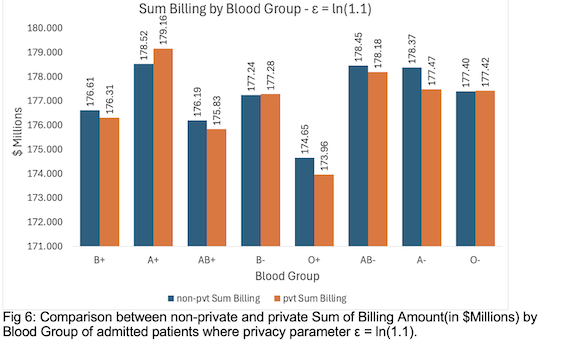
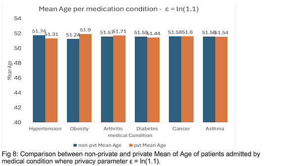

# Differential Privacy Analytics application on a Healthcare Dataset.

## **Table of Contents**  

- [Differential Privacy Analytics application on a Healthcare Dataset.](#differential-privacy-analytics-application-on-a-healthcare-dataset)
  - [Running the program:](#running-the-program)
  - [Basics of Differential Privacy:](#basics-of-differential-privacy)
    - [Definition:](#definition)
    - [Sensitivity & Laplace Mechanism:](#sensitivity--laplace-mechanism)
    - [Privacy Budget & Utility Tradeoff:](#privacy-budget--utility-tradeoff)
    - [Applications of Differential Privacy:](#applications-of-differential-privacy)
  - [Implementation:](#implementation)
    - [Assumptions:](#assumptions)
    - [Few abbreviations used:](#few-abbreviations-used)
  - [COUNT Statistics:](#count-statistics)
    - [PatientsCountPerYear](#patientscountperyear)
      - [Overview:](#overview)
      - [Privacy Mechanism:](#privacy-mechanism)
    - [Results:](#results)
  - [SUM Statistics:](#sum-statistics)
    - [SumBillingPerAgeGroup](#sumbillingperagegroup)
      - [Overview:](#overview-1)
      - [Privacy Mechanism:](#privacy-mechanism-1)
    - [Results:](#results-1)
  - [MEAN Statistics:](#mean-statistics)
    - [MeanAgePerConditionType](#meanageperconditiontype)
      - [Overview:](#overview-2)
      - [Privacy Mechanism:](#privacy-mechanism-2)
    - [Results:](#results-2)
  - [Evaluating Privacy vs Utility Tradeoff:](#evaluating-privacy-vs-utility-tradeoff)
  - [References:](#references)

## Running the program:
This program is built upon Google's Java Differential Privacy Library using a Healthcare dataset sourced from Kaggle. The csv source file is titled patient_records.csv

After navigating to the directory of the project in shell, run the following:

For Windows:
```shell
$ ./run.bat --dp ./patient_records.csv
```

For macOS:
```shell
$ javac util/src/*.java -d util/build
$ javac -cp util/build:dp/lib/* dp/src/*.java -d dp/build
$ java -cp "dp/build:util/build:dp/lib/*" dp.src.Main "patient_records.csv"
```
## Basics of Differential Privacy:

### Definition:
Differential privacy is a mathematically rigorous framework that quantifies and limits the extent to which any 
single individual’s data can influence the output of a statistical computation. This is done by injecting carefully 
calibrated noise into statistical computations such that the utility of the statistic is preserved while probably 
limiting what can be inferred about any individual in the dataset.
Given ε ≥ 0, a mechanism M is ε-differentially private if, for any two neighboring databases D and D’, differing 
only by a single individual’s record, and for any subset S ⊆ R of outputs,  Pr[M(D) ∈ S] ≤ eε · Pr[M(D’ ) ∈ S]. 
The parameter ε controls how much the distribution of outputs can depend on data from the individual x. [4]

### Sensitivity & Laplace Mechanism:
Sensitivity quantifies how much a query's output can change when the input dataset is altered by a small amount, 
typically by adding, removing, or changing a single individual's data. Measured as c or Δ for a function g that maps data D to real numbers:
max|g(D)−g(D’)| ≤ c

The Laplace mechanism is defined by Lc,ε (D) = g(D) + ν, where ν is the noise drawn from the Laplace distribution 
Lap(c/ε) added to the function g, with probability density function F(ν) = ε/2c * exp( −ε|ν|/c ). [4]
Scale of Noise addition:
The scale c/ε of the Laplace distribution controls the spread of the noise distribution. The distribution is wider for 
more sensitive functions (larger c) or stronger privacy guarantees (smaller ε), giving a higher probability of adding more noise.


The overall sensitivity c in a dataset is measured as a function of contributions by an individual across the dataset through:
* L0 Sensitivity(maxpartitionscontributed): defines how many different components of a function the individual contributed to. 
Ex: Billing a patient admitted with different conditions at different periods of time.
* LInf Sensitivity(maxcontributionsperpartition): defines how many times an individual contributed to a single component of the function. 
Ex: Billing a patient admitted multiple times with a single condition.
* L1 Sensitivity for Laplace distribution is defined as L0 * LInf, with an increase in either of them adding more noise to the data.


### Privacy Budget & Utility Tradeoff:
The Privacy Budget for a given application is the amount of accuracy loss that is acceptable when 
analyzing a given dataset. It is also the total available ε value that can be distributed across 
different measures on a given analysis. For instance, for calculating Mean statistics, which is 
Total Sum/ Total Count, the total noise budget(ε) is divided equally between Sum(ε/2) and Count(ε/2). 
A smaller value of ε, which results in high privacy but less accuracy, should be provided for highly 
sensitive data such as medical records, financial information, and vice versa, balancing the Privacy-Utility Tradeoff.

### Applications of Differential Privacy:
Differential Privacy is widely used in Statistical Analysis, such as measuring Counts, Sums, Means, Variances, 
Max, and Min values on Sensitive datasets such as Census data(US 2020 Census), Healthcare datasets, etc..  
Differential Privacy is also used in training Machine Learning models through the application of DP-SGD(Differentially Private Stochastic Gradient Descent) 
on text or image-based datasets such as ImageNet.
Prominent Big Technology companies such as Google, Apple, and Uber widely apply Differential Privacy 
techniques to secure the data privacy of individuals in their applications, such as location tracking, user analytics, etc..

## Implementation:


### Assumptions:
For our dataset, we assume each unique patient admitted to a hospital is identified by assigning a unique id based on their biodata such as age, gender, name, blood group, with no two patients having the same bio-data.
This ensures unique identification of the records and helps in determining the bounds and contributions range by each patient.

### Few abbreviations used:
CT - Medical Condition Type.
BG - Blood Group Type.
AG - Age Group.

## COUNT Statistics:
The DP library provies a primitive value for calculating the Count for any data field in a dataset. In our implementation we decided to calculate the count of the number of **unique patients** who visited the hospital based on the year, condition type, and blood type.

### PatientsCountPerYear
This is a utility that computes the number of **unique patients** visiting a hospital, broken down by year.
It outputs both the non-private (raw) and private (anonymized) couunts using the Google Differential Privacy library.

#### Overview:
The program reads hospital visits data from a file, it groups the patients by year and returns the count of distinct patients. It writes the output to two CSV files:
1. **Non-private (raw) counts** - The exact number of unique patients per year calculated without any differential privacy added
    - output: `non_private_counts_per_year.csv`
2. **Private (anonymized) counts** - The count of unique patients per year with differential privacy applied to help anonymize the data. 
    - output: `private_counts_per_year.csv`

#### Privacy Mechanism:
Private counts are computed using the `Count` primative from the Google Differential Privacy Java library. There are two privacy measures that are applied:
1.  **Contribution Bounding**: Before applying the differential privacy, each patient can appear at most `MAX_CONTRIBUTED_YEARS` different years, which is set at 2. 
```java
    private static final double LN_3 = Math.log(1.5); // Epsilon value for differential privacy
    private static final int MAX_CONTRIBUTED_YEARS = 2; // max number of years a patient can contribute to
    

    public static void run(Path path){ 
        VisitsForYear visitsForYear = IOUtils.readYearlyVisits(path);
        
        Map<Year, Integer> nonPrivatePtntCnt = getNonPrivatePatientCount(visitsForYear); // calc non-private patient/year counts
        Map<Year, Integer> privatePtntCnt = getPrivatePatientCount(visitsForYear); // calc private patient/year counts

        IOUtils.writeCountPerYear(nonPrivatePtntCnt, NON_PRIVATE_OUTPUT); // Write non-private counts to file
        IOUtils.writeCountPerYear(privatePtntCnt, PRIVATE_OUTPUT); // Write private counts to file

```
2. **Noise Addition**: After the contribution bounding, the program uses the `Count` primitive to calculate the differentially private counts:
```java
    static Map<Year, Integer> getPrivatePatientCount(VisitsForYear visits){
        Map<Year, Integer> privateCnt = new HashMap<>();
        
        // Bound the contribution: limit each patient to MAX_CONTRIBUTED_YEARS 
        VisitsForYear boundedVisits = ContributionBoundingUtils.boundContributedYears(visits, MAX_CONTRIBUTED_YEARS);
        
        for (Year year : boundedVisits.getYearsWithData()){
            Set<Integer> uniquePtnt = new HashSet<>();
            for (PatientRecord record : boundedVisits.getVisitsForYear(year)) {
                uniquePtnt.add(record.id);
            }

            Count dpCount = Count.builder()
                .epsilon(LN_3)
                .maxPartitionsContributed(MAX_CONTRIBUTED_YEARS)
                .build();
            
            dpCount.incrementBy(uniquePtnt.size());
            privateCnt.put(year, (int) dpCount.computeResult());
        }
        return privateCnt;
    }
```

### Results:
The below graphs show the comparison of non-private vs private patient counts and the impact of how the choice of epsilon (ε) influences the balance between the privacy and utility in the healthcare dataset. 


Fig 3. shows a comparison between private and non-private patient counts per year with different epsilon values. The left graph the epsilon value is set `ε = ln(1.10)` and in the right graph the epsilon value is set `ε = ln(1.05)`. When the epsilon value is set to `ln(1.10)` there is minimal difference between the private vs non-private counts indicating less noise was added. In contrast when the epsilon value is set to `ln(1.05)` the difference between the private and non-private counts were larger, indicating more noise and therefore more privacy.


Fig 4. shows the comparison between the private and non-private patient counts per condition type with different epsilon values. The left graph the epsilon value is set `ε = ln(1.10)` and in the right graph the epsilon value is set `ε = ln(1.05)`. The same pattern is seen in Fig 4. as in Fig 3. 

## SUM Statistics:

DP Library provides methods for the calculation of Bounded Sum for the desired field in the given dataset.
We chose to calculate the private sum of billing amount based on the Year/Condition/Gender.

### SumBillingPerAgeGroup
This is a utility that computes the total **Sum Billing amount** of patients belonging to a particular Age Group.
It outputs both the non-private (raw) and private (Privacy Preserving) Sums using the Google Differential Privacy library.

#### Overview:
The program reads hospital visits data of patients from a file, it groups the patients by Age Group and returns the Sum of total Billing amount. It writes the output to two CSV files:
1. **Non-private (raw) Sum** - The exact total of Billing Sum per Age Group calculated without any differential privacy added.
   - output: `non_private_sums_billing_per_AgeGroup.csv`
2. **Private (privacy preserving) Sum** - The total of Billing Sum per Age Group with differential privacy applied to help privatise the data.
   - output: `private_sums_billing_per_AgeGroup.csv`

#### Privacy Mechanism:
Private Sums are computed using the `BoundedSum` primitive from the Google Differential Privacy Java library. There are three privacy measures that are applied:

1.  **Contribution Bounding**: Before applying the differential privacy, each patient can appear at most `MAX_PARTITION_CONTRIBUTIONS` different Age Groups, which is set at 2, accounting for spread of same patient across years.
2. **Clamping Bounds**:
Clamping the contribution by any individual through lower and upper bounds handles exceptions, where an individual contributes an
infinitely large or small value, distorting the scale of noise to be added.
For instance, clamping the billing amount lower limit as $0 and the highest limit as $50000 ensures extreme
contributions by certain patients are handled gracefully, which reduces
the scale of noise added.
```java
    private static final double LN_X = Math.log(1.1);
   /**
    * The maximum number of different age groups a single patient can contribute to.
    * All contributions to additional age groups will be discarded.
    */
   private static final int MAX_PARTITION_CONTRIBUTIONS = 2;
   /** Minimum billing amount expected for a single visit. */
   private static final int MIN_EUROS_SPENT = 0;
   /** Maximum billing amount expected for a single visit. */
   private static final int MAX_EUROS_SPENT = 50000;

   public static void run(Path path) {
      VisitsForAG visitsForAG = IOUtils.readAGVisits(path);
   
      Map<String, Double> nonPrivateSums = getNonPrivateSums(visitsForAG);
      Map<String, Double> privateSums = getPrivateSums(visitsForAG);
   
      IOUtils.writeSumsBillingPerAG(nonPrivateSums, NON_PRIVATE_OUTPUT);
      IOUtils.writeSumsBillingPerAG(privateSums, PRIVATE_OUTPUT);
   }

```
3. **Noise Addition**: After the contribution bounding, the program uses the `BoundedSum` primitive to calculate the differentially private Sum.

   **Preaggregation**:
      For statistics like Sum, where an individual can contribute different amounts in a single partition, the sensitivity takes only the
      maximum amount and multiplies it by the number of contributions, which
      exaggerates the total sum of actual contributions made. Hence, preaggregation of the contribution by an individual in a single partition
      should be done before calculating noise. Ex: A patient might be billed
      $10k for the first visit and $50k for the second visit in a single year(partition), while his total contribution is $60k, without
      preaggregation, his contribution might be exaggerated to $100k, taking only the max value.
      The code is as implemented as below:
```java
 private static Map<String, Double> getPrivateSums(VisitsForAG visits) {
   Map<String, Double> privateSumsPerAG = new HashMap<>();

   // Pre-process the data set: limit the number of age groups a patient can contribute to.
   VisitsForAG boundedVisits =
           ContributionBoundingUtils.boundContributedAG(visits, MAX_PARTITION_CONTRIBUTIONS);

   for (String AG : boundedVisits.getAGWithData()) {
      BoundedSum dpSum =
              BoundedSum.builder()
                      .epsilon(LN_X)
                      // The data was pre-processed so that each patient may contribute to at most
                      // MAX_PARTITION_CONTRIBUTIONS partitions (age groups).
                      // Note: while the library accepts this limit as a configurable parameter,
                      // it doesn't pre-process the data to ensure this limit is respected.
                      // It is the responsibility of the caller to ensure the data passed to the library
                      // is capped to get the correct privacy guarantee.
                      .maxPartitionsContributed(MAX_PARTITION_CONTRIBUTIONS)
                      // BoundedSum will clamp the input values to these bounds.
                      .lower(MIN_EUROS_SPENT)
                      .upper(MAX_EUROS_SPENT)
                      .build();
      
      // For each patient, pre-aggregate their spending for the Age Group.
      Map<Integer, Double> patientToAGSpending = new HashMap<>();
      for (PatientRecord r : boundedVisits.getVisitsForAG(AG)) {
         int id = r.id;
         if (patientToAGSpending.containsKey(id)) {
            double newAmount = patientToAGSpending.get(id) + r.bill;
            patientToAGSpending.put(id, newAmount);
         } else {
            patientToAGSpending.put(id, (double) r.bill);
         }
      }

      for (PatientRecord r : boundedVisits.getVisitsForAG(AG)) {
         dpSum.addEntry(r.bill);
      }

      privateSumsPerAG.put(AG, (double) dpSum.computeResult());
   }

   return privateSumsPerAG;
}
```
### Results:
We evaluated the Sum of Billing amounts for patients by Age Groups, Blood Type, and medical condition with the following results:




From the above Figures 5&6, we notice an accuracy difference of 1-2% between non-pvt and pvt Sum statistics, thereby 
protecting privacy by limiting information about an individual's contribution to the dataset, with minimal change in accuracy/utility.
## MEAN Statistics:

DP Library provides methods for the calculation of Bounded Mean for the desired field in the given dataset.
We chose to calculate the private Mean of billing amount based on the medical condition/admit Year and also the private Mean Age of patient admitted by medical condition.

### MeanAgePerConditionType
This is a utility that computes the **Mean Age** of patients admitted with a particular medical condition.
It outputs both the non-private (raw) and private (privacy preserving) Means using the Google Differential Privacy library.

#### Overview:
The program reads hospital visits data of patients from a file, it groups the patients by Condition Type and returns their Mean Age by calculating sum of ages and divided by number(count) of patients for each medical condition. It writes the output to two CSV files:
1. **Non-private (raw) Mean** - The exact Mean Age of patients grouped by medical condition calculated without any differential privacy added.
   - output: `non_private_mean_age_per_condition.csv`
2. **Private (privacy preserving) Mean** - The Mean Age of patients grouped by medical condition with differential privacy applied to both Sum of ages of patients and number(count) of patients with the given medical condition.
   - output: `private_mean_age_per_condition.csv`

#### Privacy Mechanism:
Private Means are computed using the `BoundedMean` primitive from the Google Differential Privacy Java library. There are three privacy measures that are applied:

1.  **Contribution Bounding**: Before applying the differential privacy, each patient can appear at most `MAX_PARTITION_CONTRIBUTIONS` different medical conditions, and contribute `MAX_CONTRIBUTIONS_PER_PARTITION` at most records for each medical condition, both of which are set at 2, accounting for spread of same patient across medical conditions and within a medical condition.
2. **Clamping Bounds**:
   Clamping the contribution by any individual through lower and upper bounds handles exceptions, where an individual age 
   might be infinitely large or small value, distorting the scale of noise to be added.
   For instance, clamping the age groups at lower limit as 10 years and upper limit as 90 years ensures extreme
   ages of some patients added accidentally are handled gracefully, which reduces
   the scale of noise added.
```java
    private static final double LN_X = Math.log(1.1);

   // The maximum number of different medical conditions a patient can contribute to.
   // This helps prevent any single patient from having an outsized influence on the overall result.
   private static final int MAX_PARTITION_CONTRIBUTIONS = 2;
   
   // The maximum number of records a patient can contribute to for a single medical condition.
   private static final int MAX_CONTRIBUTIONS_PER_PARTITION = 2;
   
   // The plausible bounds for a patient's age. These values are used to clamp the input data,
   // which is a requirement for many differential privacy mechanisms.
   private static final int MIN_AGE = 10;
   private static final int MAX_AGE = 90;
   
public static void run(Path path) {
   VisitsForCT visitsForCT = IOUtils.readCTVisits(path);

   Map<String, Double> nonPrivateMeans = getNonPrivateMeans(visitsForCT);
   Map<String, Double> privateMeans = getPrivateMeans(visitsForCT);

   // Write the calculated means to their respective output files.
   IOUtils.writeMeansAgePerCT(nonPrivateMeans, NON_PRIVATE_OUTPUT);
   IOUtils.writeMeansAgePerCT(privateMeans, PRIVATE_OUTPUT);
}

```
3. **Noise Addition**: After the contribution bounding, the program uses the `BoundedMean` primitive to calculate the differentially private Mean.
   However, unlike Sum, Mean doesn't require pre-aggregation due to the nature of the algorithm implemented in the library.
  
   The code is as implemented as below:
```java
 private static Map<String, Double> getPrivateMeans(VisitsForCT visits) {
   Map<String, Double> privateMeansPerCT = new HashMap<>();

   // Pre-process the data by applying contribution bounding to limit the influence of any single user.
   VisitsForCT boundedVisits =
           ContributionBoundingUtils.boundContributedCT(visits, MAX_PARTITION_CONTRIBUTIONS);

   for (String CT : boundedVisits.getCTWithData()) {
      // Initialize the BoundedMean utility from the Google DP library with our privacy parameters.
      BoundedMean dpMean =
              BoundedMean.builder()
                      .epsilon(LN_X)
                      .maxPartitionsContributed(MAX_PARTITION_CONTRIBUTIONS)
                      .maxContributionsPerPartition(MAX_CONTRIBUTIONS_PER_PARTITION)
                      .lower(MIN_AGE)
                      .upper(MAX_AGE)
                      .build();

      // Add each patient's age to the BoundedMean instance.
      for (PatientRecord r : boundedVisits.getVisitsForCT(CT)) {
         dpMean.addEntry(r.age);
      }

      // Compute the differentially private result and store it.
      privateMeansPerCT.put(CT, dpMean.computeResult());
   }

   return privateMeansPerCT;
}
```
### Results:
We evaluated the Mean Billing amount by Age Group of patients and Mean Age per medical condition of patients with the following results:



Similar to Sum Statistics, from the above Figures 7&8, we notice an accuracy difference of 1-2% between non-pvt and pvt Means, thereby
protecting privacy by limiting information about an individual's contribution to the dataset, with minimal change in accuracy/utility.

## Evaluating Privacy vs Utility Tradeoff:


We notice reduced utility with accuracy loss ranging 1-4% for ε value at ln(1.03) when compared to ln(1.1), where accuracy loss 
ranged from 0-1%. Thus, a low privacy budget(ε) suits highly sensitive applications where individual privacy is weighted more 
heavily than high accuracy, while still maintaining general utility.

## References:
[1]	Prasad Patil, "Healthcare Dataset." (2024). Distributed by Kaggle. https://www.kaggle.com/datasets/prasad22/healthcare-dataset (accessed July 10, 2025).

[2]	Google, Differential Privacy. 2025. Github. Accessed: July 2025. [Online]  Accessible at https://github.com/google/differential-privacy/

[3]	Simson Garfinkel, John M. Abowd, and Christian Martindale. 2019. Understanding database reconstruction attacks on public data. Commun. ACM 62, 3 (March 2019), 46–53. https://doi.org/10.1145/3287287

[4] 	“Differential Privacy: An Economic Method for Choosing Epsilon” by Hsu et al., Accessible at: https://haeberlen.cis.upenn.edu/papers/epsilon-csf2014.pdf
